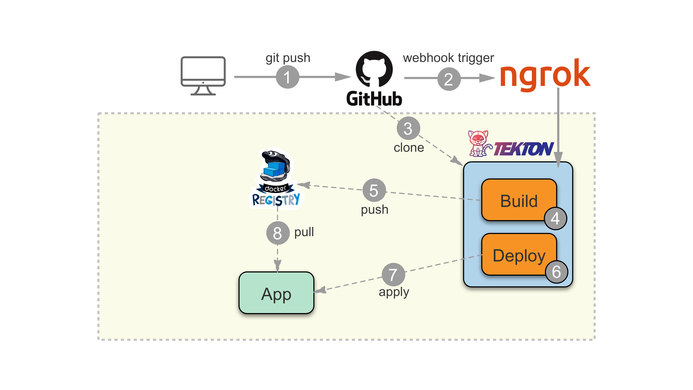

# Tekton Tutorial

A quickstart guide to do CI/CD using Tekton with GitHub repositories.

The diagram describes the final workflow:



* GitHub push events send a POST request to Tekton Triggers.
* Tekton Trigger generates a `build-and-deploy` PipelineRun.
* `build-and-deploy` Pipeline triggers build and deploy tasks.
* `build` Task compiles the code and pushes the image to local registry.
* `deploy` Task deploys the `k8s` resources and does rollout restart.

> Note: This is a lightweight setup of CI/CD. For a complete GitOps-style CI/CD it is preferred to perform CI using [Tekton] and CD using [ArgoCD].

[Tekton]: https://tekton.dev/
[ArgoCD]: https://argoproj.github.io/argo-cd/core_concepts/

### Table of Contents

* [Install Kubernetes]: Install a fresh kubernetes cluster locally on your machine.
* [Install Tekton]: Install tekton on the kubernetes cluster.
* Install Tekton Resources:
  * [Install Build Task]: Install `build` task, which compiles the code and pushes the image to local registry.
  * [Install Deploy Task]: Install `deploy` task, which deploys the resources and does rollout restart.
  * [Install Build-and-Deploy Pipeline]: Install `build-and-deploy` pipeline which triggers build and deploy tasks.
  * [Install GitHub Trigger]: Install github event trigger which receives push events and triggers the pipeline.
* [Setup GitHub Webhook]: Set GitHub Webhook to send push events to tekton triggers.

[Install Kubernetes]: docs/1.install-kubernetes.md
[Install Tekton]: docs/2.install-tekton.md
[Install Build Task]: docs/3.install-build-task.md
[Install Deploy Task]: docs/4.install-deploy-task.md
[Install Build-and-Deploy Pipeline]: docs/5.install-build-and-deploy-pipeline.md
[Install GitHub Trigger]: docs/6.install-github-trigger.md
[Setup GitHub Webhook]: docs/7.setup-github-webhook.md

This tutorial has been tested on MacOS but you should also be able to run it on Linux and Windows, as all tools mentioned here are supported on all these environments.

### TL;DR

Eager to start? Skip the guide and run the following:

```sh
# install kubernetes (with registry & registry-aliases addons)
minikube start --addons registry --addons registry-aliases

# create namespace for app (and grant access to tekton-pipelines)
kubectl create namespace tekton-tutorial
kubectl create rolebinding admin \
  --clusterrole admin \
  --namespace tekton-tutorial \
  --serviceaccount default:default

# install tekton (pipeline & triggers)
kubectl apply -f https://storage.googleapis.com/tekton-releases/pipeline/previous/v0.20.1/release.yaml
kubectl apply -f https://storage.googleapis.com/tekton-releases/triggers/previous/v0.11.1/release.yaml

# install tekton resources (pipelineresources, tasks, pipelines, triggers)
kubectl apply -f tekton/1.resources/ -f tekton/2.tasks/ -f tekton/3.pipelines -f tekton/4.triggers

# create github secret
export TEKTON_TUTORIAL_SECRET_TOKEN=${TEKTON_TUTORIAL_SECRET_TOKEN-$(head -c 24 /dev/random | base64)}
kubectl create secret generic github-secret --from-literal=secretToken=$TEKTON_TUTORIAL_SECRET_TOKEN
echo "TEKTON_TUTORIAL_SECRET_TOKEN: $TEKTON_TUTORIAL_SECRET_TOKEN"
```

> As an added bonus after the above setup you can skip-forward to any command described on the tutorial, there no other inter-dependencies.

Lastly [Setup GitHub Webhook] and you're good to go. Push a change on the repository and it will trigger the Pipeline.

Let's change the text it responds on the `main.go`:

```diff
 func HelloServer(w http.ResponseWriter, r *http.Request) {
-       fmt.Fprintf(w, "Hello")
+       fmt.Fprintf(w, "Hello, this is awesome!!")
 }
 ```

and push it to the repository, then monitor the generated PipelineRun:

```sh
# see PipelineRun progress
❯ tkn pr list
NAME                         STARTED         DURATION   STATUS
github-run-7xgnp             2 minutes ago   ---        Running

# see PipelineRun succeeded
❯ tkn pr list
NAME                         STARTED         DURATION    STATUS
github-run-7xgnp             3 minutes ago   2 minutes   Succeeded

# check tekton-tutorial service is running
❯ kubectl get deploy,pod,svc -n tekton-tutorial
NAME                              READY   UP-TO-DATE   AVAILABLE   AGE
deployment.apps/tekton-tutorial   1/1     1            1           43s

NAME                                  READY   STATUS    RESTARTS   AGE
pod/tekton-tutorial-58f59757c-6dsbr   1/1     Running   0          43s

NAME                      TYPE       CLUSTER-IP      EXTERNAL-IP   PORT(S)          AGE
service/tekton-tutorial   NodePort   10.110.24.217   <none>        8080:31348/TCP   43s

# open tekton-tutorial service with applied changes
❯ minikube service tekton-tutorial -n tekton-tutorial
|-----------------|-----------------|-------------|----------------------------|
| NAMESPACE       |      NAME       | TARGET PORT |            URL             |
|-----------------|-----------------|-------------|----------------------------|
| tekton-tutorial | tekton-tutorial |        8080 | http://192.168.64.55:30357 |
|-----------------|-----------------|-------------|----------------------------|
🎉  Opening service tekton-tutorial/tekton-tutorial in default browser...
```
