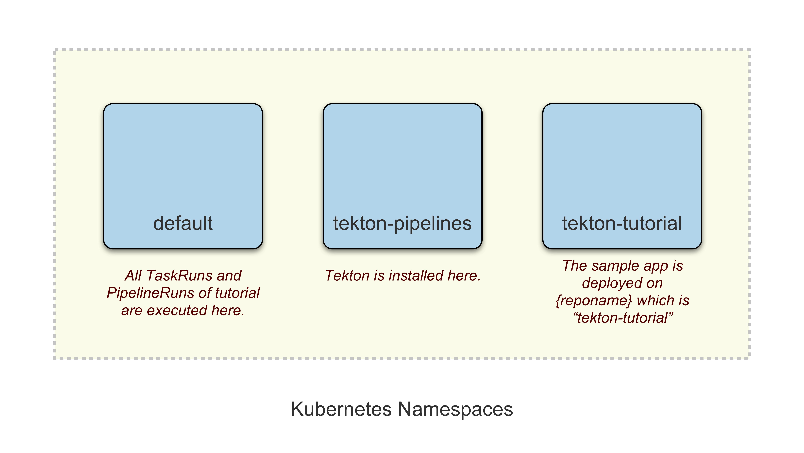

# Install Kubernetes

During the section we'll prepare our Kubernetes cluster on our local machine using `minikube` and have registry addon enabled so that we can push and pull images locally.

We'll also create a namespace `tekton-tutorial` for the deployment of our sample app and grant the necessary `admin` privileges for our workflow.

### Requirements

Before starting make sure you have installed the following CLI tools locally:

* [minikube](https://github.com/kubernetes/minikube): minikube implements a local Kubernetes cluster on macOS, Linux, and Windows.
* [kubectl](https://kubernetes.io/docs/tasks/tools/install-kubectl/): The Kubernetes command-line tool allows you to run commands against Kubernetes clusters.

### Steps

Let's start minikube cluster with some pre-configured configuration and addons:

```sh
❯ minikube start --addons registry --addons registry-aliases
😄  minikube v1.17.0 on Darwin 10.15.7
✨  Automatically selected the hyperkit driver. Other choices: parallels, ssh, virtualbox
👍  Starting control plane node minikube in cluster minikube
🔥  Creating hyperkit VM (CPUs=2, Memory=2200MB, Disk=20000MB) ...
🐳  Preparing Kubernetes v1.20.2 on Docker 20.10.2 ...
    ▪ Generating certificates and keys ...
    ▪ Booting up control plane ...
    ▪ Configuring RBAC rules ...
🔎  Verifying Kubernetes components...
🔎  Verifying registry addon...
🌟  Enabled addons: storage-provisioner, registry-aliases, default-storageclass, registry
🏄  Done! kubectl is now configured to use "minikube" cluster and "default" namespace by default
```

To interact with the cluster use `kubectl`, let's check the nodes, it should show one node in `Ready` state:

```sh
❯ kubectl get nodes
NAME       STATUS   ROLES                  AGE    VERSION
minikube   Ready    control-plane,master   106s   v1.20.2
```

We use [registry-aliases](https://github.com/kubernetes/minikube/tree/master/deploy/addons/registry-aliases) minikube addon to run a registry locally and configure DNS to point to the registry. You can push and pull from the registry using `example.com` as registry URL.


***Namespaces***

The following diagram displays the namespaces we'll be using during the tutorial:



* The `default` namespace is where all TaskRuns and PipelineRuns of the tutorial will be running.
* The `tekton-pipelines` will be created when we install Tekton so we don't need to prepare anything special.
* The `tekton-tutorial` is where our sample app will be deployed by our CI/CD workflow (The workflow deploys the app on the namespace matching the repo name).

So, before our workflow is able to deploy our app, we need to first create the namespace and grant it privileges:

```sh
# create namespace for sample app
kubectl create namespace tekton-tutorial

# grant privileges to deploy to namespace
kubectl create rolebinding admin \
  --clusterrole admin \
  --namespace tekton-tutorial \
  --serviceaccount default:default
```

### Deep Dive

If you want to learn more about the steps involved in this section, here are some interesting references:

* [minikube](https://github.com/kubernetes/minikube): minikube home page.
* [minikube - getting started guide](https://minikube.sigs.k8s.io/docs/start/): minikube installation and quickstart guide.
* [minikube - registry aliases demo app](https://github.com/kameshsampath/minikube-registry-aliases-demo): An sample app to demonstrate how the minikube registry-aliases addon work using [skaffold](https://skaffold.dev/).

### Next Step

Once the cluster is up and running, see the [Install Tekton](2.install-tekton.md) tutorial.

### Tear Down

If you want to tear down the minikube cluster:

```sh
❯ minikube delete
🔥  Deleting "minikube" in hyperkit ...
💀  Removed all traces of the "minikube" cluster.
```
