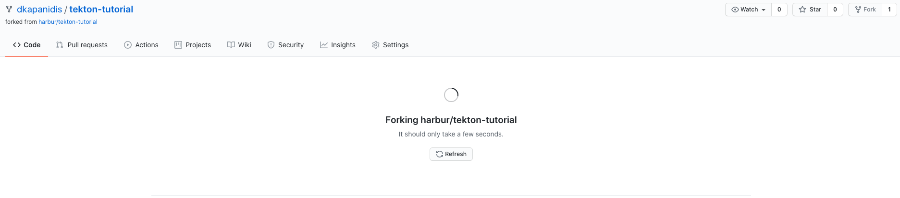
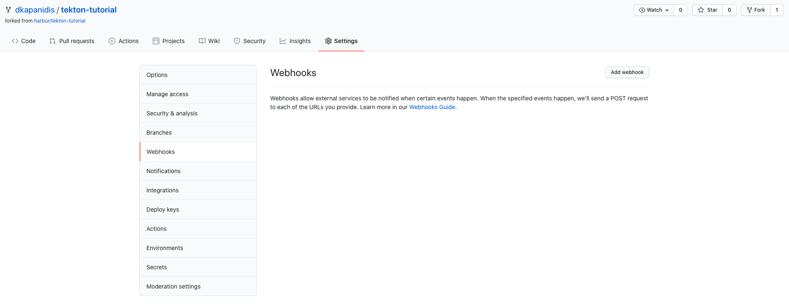
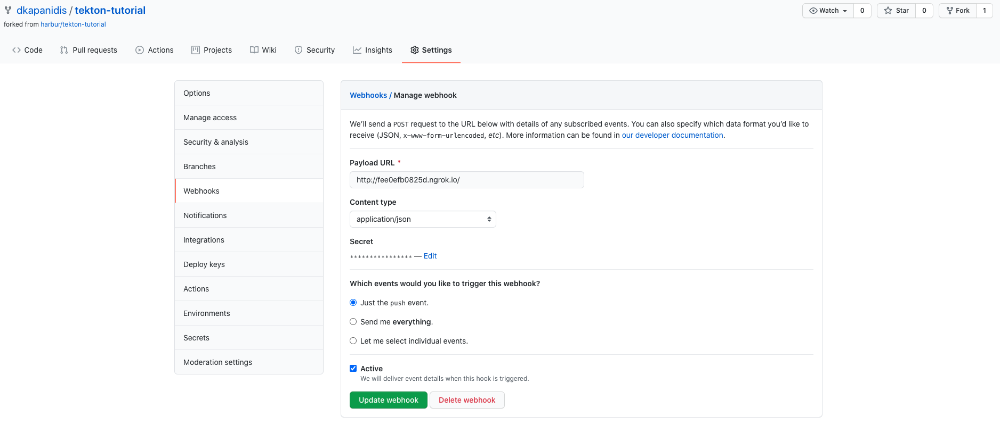

# Setup GitHub Trigger

On this section we'll be preparing a webhook trigger on the GitHub repository so that push events send a notification to our Tekton Triggers which in turn runs our PipelineRun.

### Requirements

* [ngrok](https://ngrok.com/) A CLI to easily expose local endpoints publically.

### Expose Endpoint

Before configuring the GitHub to send events, we need a public endpoint so where GitHub can send the events. Since we're running the tutorial locally we need a bastion to redirect the events. In a real scenario you may have your real cluster on a cloud provider and configured a ingress controller to expose the Service. We'll bypass all this since it's not the core concept here by port-forwarding the Service to expose it from the cluster and then use `ngrok` to tunnel it to a public endpoint.

The service we want to expose is `el-github-listener-interceptor`:

```sh
❯ kubectl get svc el-github-listener-interceptor
NAME                             TYPE        CLUSTER-IP      EXTERNAL-IP   PORT(S)    AGE
el-github-listener-interceptor   ClusterIP   10.97.199.160   <none>        8080/TCP   70m
```

Let's expose it locally (keep the terminal open):

```sh
❯ kubectl port-forward svc/el-github-listener-interceptor 8080
Forwarding from 127.0.0.1:8080 -> 8000
Forwarding from [::1]:8080 -> 8000
```

we can test it using curl:

```sh
❯ curl localhost:8080
{"eventListener":"github-listener-interceptor","namespace":"tekton-pipelines","eventID":"7knkb"}
```

Now let's expose it with `ngrok` to a public endpoint (keep the terminal open):

```sh
❯ ngrok http 8080
ngrok by @inconshreveable

Session Status                online
Account                       Dimitris Kapanidis (Plan: Free)
Version                       2.3.35
Region                        United States (us)
Web Interface                 http://127.0.0.1:4040
Forwarding                    http://fee0efb0825d.ngrok.io -> http://localhost:8080
Forwarding                    https://fee0efb0825d.ngrok.io -> http://localhost:8080
```

Now let's test the public endpoint:

```sh
❯ curl http://fee0efb0825d.ngrok.io
{"eventListener":"github-listener-interceptor","namespace":"tekton-pipelines","eventID":"7knkb"}
```

> Bear in mind that the url is ephemeral and will change every time you re-open your tunnel, leave it open during the tutorial.

### Steps

First of all we need a repository to build, you can clone the same repo as it already contains an example to build and deploy, but any repository can be injected here as long as it has a `Dockerfile` and a `k8s` directory.

Fork Repository:



Go to Settings > Webhooks:



Add Webhook:



Configure webhook:
* Payload URL: The public endpoint.
* Content type: `application/json`
* Secret: The `TEKTON_TUTORIAL_SECRET_TOKEN` generated while installing github trigger.
* Which events would you like to trigger this webhook? `Just the push event.`

